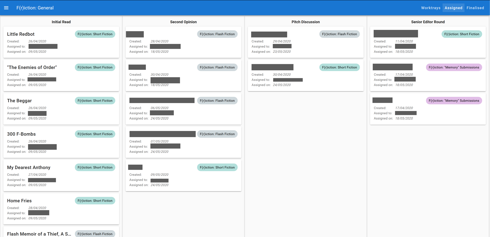

# Brink Submissions Manager

## Background

While managing the IT resources for the nonprofit Brink Literacy Project, I realised that they could save staff time by automating the process they use to manage the reading of submissions to their contests and journal.

The submissions are collected through Submittable (a SAAS offering for collecting submissions), but their platform is prohibitively expensive for Brink to manage the reading process there&mdash;even with a lit journal discount, the cost would still be over $150/m for the number of seats they need and submissions that they receive. Further, even if they did pay, Submittable does meet all the requirements that they have for their submission management process.

As such, Brink designed their own manual process. However, tracking the twenty-five or so editors who read submissions each week is a considerable administrative overhead.

I was the sole developer on this project. I worked with two key stakeholders from Brink, (the COO and Editorial Director, who is the administrator of the submissions process) to design the system and then made all technical decisions myself.

## Workflow

The basic conceptualisation behind the workflow is to recreate an administrator's desk. As submissions arrive, they are placed into a *worktray* ready to be assigned to an editor to be read and graded. These submissions would then be handed out as a task to a first reader. When the first reader has graded their piece, they hand it back to the administrator who either places it in a *Second Opinion Worktray* or *Reject Worktray* depending on the grade that was given, and so on.

Below is the image that I developed with the stakeholders to map out the workflow for reading by Junior Editors for their journal's general reading (as opposed to contest reading, which has a slightly different process):

### Key &ndash; Base Components

| Shape and colour | Meaning |
| -- | -- |
| Blue Square | Worktray |
| Light Blue Rounded Square | User |
| Grey Square w Blue Border | Reason (sub-category of worktray) |
| Orange Parallelogram | Submissions status changed is changed |
| Dark Purple Circle | Task for a user to complete |
| Light Purple Circle | Read-only notification to communicate something to a user |
| Blue underlined text | Field to complete |
| Red Parallelogram | Outcome of a task (graded, single choice or multiple choice) |
| Green BG and underlined text | Sharing information about previous stage |
| Brown BG and underlined text | Notes about the step |

### Workflow Engine

The engine that underpins this workflow is generic and so the base components can be combined together to form other workflows. The UI is also generated from the different components that make up the workflow, to accommodate the generic design.

This allows for future extension and for the system to be easily adapted to changes in the process over time.

## Architecture

I chose to host the app in Azure for two reasons:
1. Microsoft offers a generous grant to nonprofits that Brink can use as credits.
2. Brink already use Office 365 as their cloud platform (Office 365 offers a generous amount of free cloud storage, which is important for an organisation that works with a lot of large graphics files online).

### Database

I did not want the overhead of managing a database, so I chose Azure Cosmos DB with a MongoDB adapter. The schema is written using Mongoose.

### File Storage

Files are stored as blobs in Azure Storage.

### App Server

The server is written in vanilla JS using Express. 

Authentication is managed by Microsoft. The users sign into their Azure AD account in order to access the app (or call any of the API methods). This is a relatively simple yet robust solution.

The app is hosted in an Azure App Service instance.

### App Frontend

The frontend is a Vue SPA with a Vuex store and Routing.

As this is released internally, it seemed unnecessary to brand the app, so I used Vuetify as a styling framework.

### Serverless Functions

There are several functions that handle certain tasks:
* Auto-importing submissions
* Importing files into the storage
* Queuing relevant submissions to be synced with Submittable
* Syncing submissions with Submittable 

### DevOps

* The code is hosted in GitHub.
* Docker is used to build the app
* An Azure Pipeline runs whenever code is checked into the master branch
   * It builds the App and Functions and saves the Docker images to a private repository
   * At some point I would like to extend this so that it deploys to the relevant slots when a build is complete.

## UI Examples

Below, I have included short descriptions of pieces of functionality together with screenshots of the UI. Any identifiable information has been covered in the screenshots.

### Worktrays

#### Cleaning Submissions

In order to ensure all submissions are read anonymously, the administrator can update the title of a submission, change the names of the files (including using some preset helpers) and reupload a modified file where necessary.

####  Assigning Worktray

I did not want the assigning process to be prescriptive, so there are several ways that one can work with this worktray. You can either assign a piece by clicking the editor's names in the 'Assign to' section of the submission, or their name in their card in the staff column. The staff list can reorder itself as submissions are assigned to help ensure that the assignments are evenly distributed.

We did discuss automatic assignments, but the team wanted to keep a level of oversight on the process.

I created a filter system so that the administrator can be customise what the worktray displays, depending on what they are trying to do:

####  Single Action Worktray

Single action worktrays are general purpose. The below example shows submissions that have been graded below a B+ and so are not carrying on in the process. The administrator can click through to the Submittable record to add the editor's rejection letter and mark it as declined. The Submittable API is read only, so this manual intervention is required.

### Assigned Submissions

The administrator can keep track of assigned submissions using the *Assigned* board

### Submission Details

The administrator can also access a full overview of the details of a submission from any of the worktrays and boards above:

### Task

Here is an example of a what a general user sees for *Initial Read* task that has been assigned to them. NB: the *Rejection Letter* field is only displayed if the selected grade is lower than a B+.

## Current Status

The system was initially tested for five weeks by a group of four Junior Editors. I made some changes based on their feedback, which included implementing autosave functionality on tasks and handling some edge cases. Since then, it has been released internally to the entire Junior Editor team and is working smoothly. 

I hope this has given you a taster of the app. The code in Github is private, but I would happily show you around it or the app itself if you would like to see more.